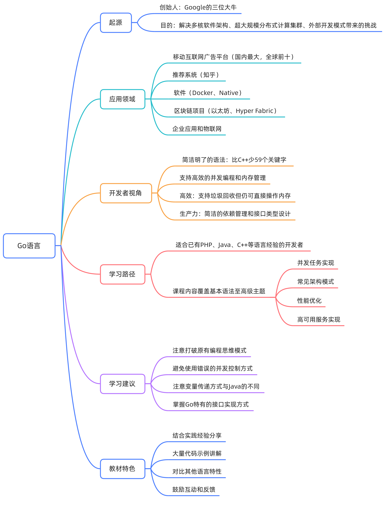
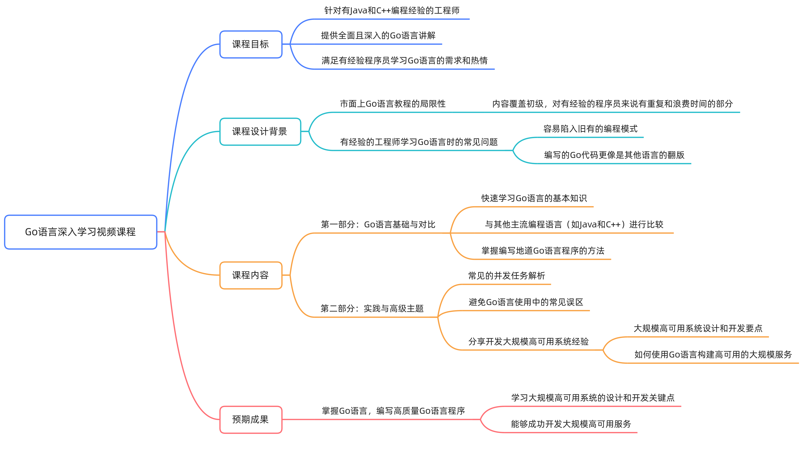
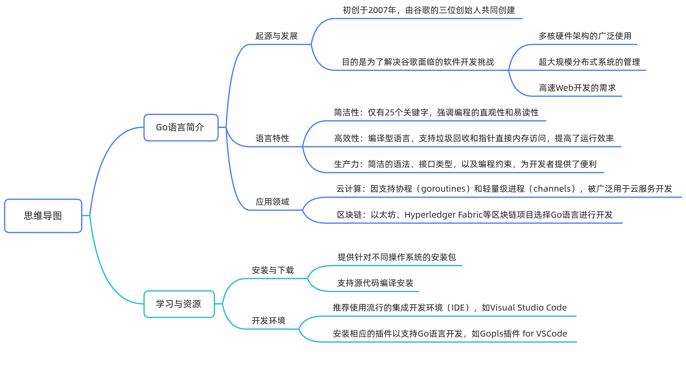
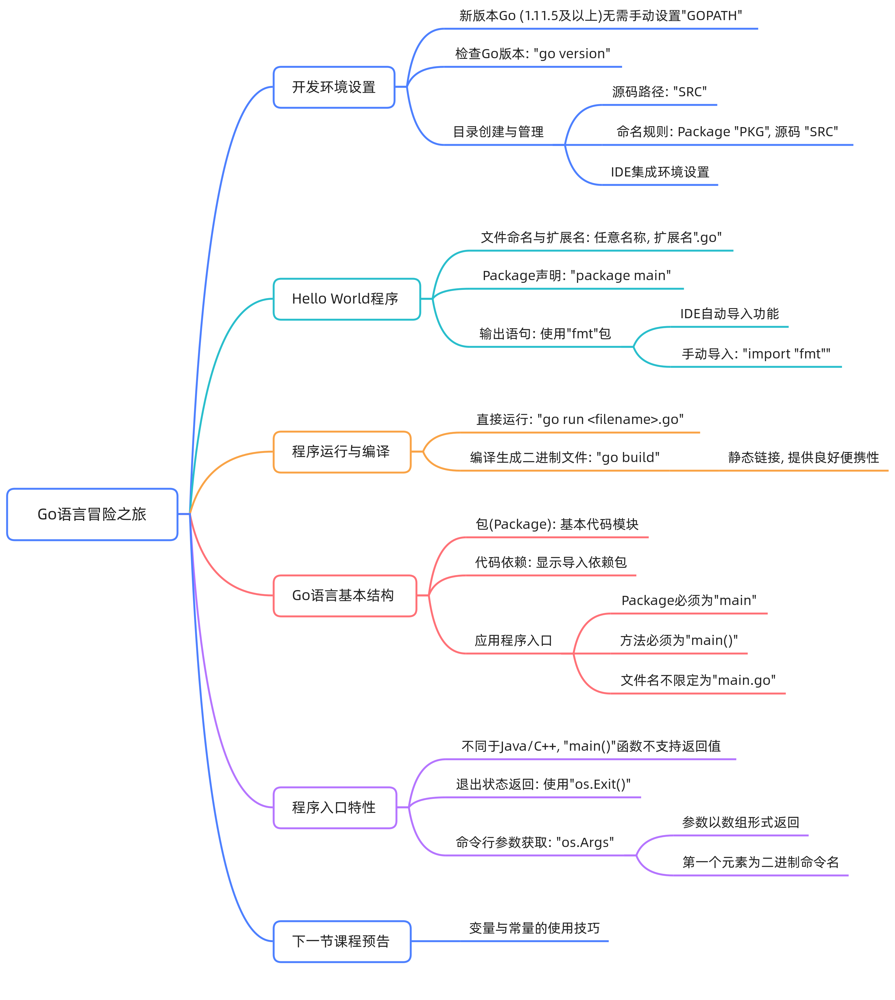
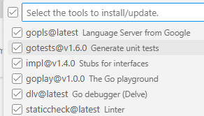

Go 语言从入门到实战-极客时间


# Go语言的起源与发展

## 简介

设计初衷

> Go 语言的雏形设想始于 2007 年，由 Google 的三位创始人设计，旨在解决以下问题：

软件开发的新挑战：

> 多核软件架构。
>
> 超大规模的分布式计算集群。
>
> 外部开发模式带来的前所未有的开发规模与更新速度。

Go语言的核心优势简洁性

> Go 语言仅有 25 个关键字，相较 C（37 个）和 C++（84 个）更简单。
>
> 并发支持与内存管理
> 内置并发支持（基于 CSP 模型）和垃圾回收机制，简化并发编程复杂度。
>
> 高效性
> 是强类型，静态类型编译语言，支持垃圾回收机制，支持指针直接访问内存，提供更高效的内存访问能力，性能接近 C。
>
> 高生产力
> 依赖管理简洁清晰，接口类型设计独特，支持组合而非继承的扩展方式。体现了“组合优于继承”的设计理念。


**Go语言学习常见误区**

误区一：沿用其他语言的并发模型，容易写出“用其他语言思维写的Go程序”。

> C/C++ 程序员倾向大量使用共享内存进行并发控制，忽略 Go 内置的 CSP 并发机制。
>
> 真正掌握并编写地道的Go语言程序。

误区二：Java 风格的数组传递方式

> Java 程序员常直接传递数组，导致大量内存复制（Go 中数组是值复制传递）。

误区三：过度依赖接口定义包创建仅含接口定义的包处理依赖关系，实际上 Go 接口实现无需依赖接口定义。

## 应用

**云端开发语言**
Docker、Kubernetes等云原生技术大量使用Go语言。因此Go被称为“云计算语言”。

**区块链开发语言**
区块链项目如以太坊、Hyperledger Fabric 均可用 Go 开发，故也被称作“区块链开发语言”。

**其他应用**
传统企业应用和物联网应用也有 Go 的身影，其应用范围仍在不断扩展。









# 基础语法

## 开发环境

```bash
GOPATH
1. 在1.8版本前必须设置这个环境变量
2. 1.8版本后（含1.8）如果没有设置使用默认值
在Unix上默认为`$HOME/go`，在Windows上默认为`%USERPROFILE%/go`
在Mac上GOPATH可以通过修改`~/.bash_profile`来设置
```

查看版本：`go version`

文件扩展名为 `.go`

基本程序结构

```go
// 包，表明代码所在的模块（包）
package main

// 引入代码依赖
import (
	"fmt"
	"os"
)

// 程序主入口
func main() {
	if len(os.Args) > 1 {
		fmt.Println("Hello World", os.Args[1])
	} else {
		fmt.Println("Hello World")
	}
}
```

运行

```bash
go run hello.go
go run hello.go 参数1
```

构建（默认静态链接，生成独立可执行文件，具备良好移植性）

```bash
go build
```

**应用程序入口**

1、必须是 main 包：`package main`，目录不一定是main，**go不要求package名称和目录名称保持一样**

2、必须是 main 方法：`func main()`

3、文件名不一定是 `main.go`

4、src源码路径通常命名为：`GOPATH/src/包名/`

**退出返回值** 

与其他主要编程语言的差异：

1、Go中main函数不支持任何返回值，`func main must have no arguments and no return values`

2、通过`os.Exit`来返回状态

**获取命令行参数** 

与其他主要编程语言的差异：

1、main 函数不支持传入参数 `func main(arg []string)`

2、在程序中直接通过 `os.Args` 获取命令行参数


**vs code配置**

配置环境变量：

```bash
GOPATH
C:\Program Files\Go\

$go env
```

```bash
打开terminal
ctrl + shift + `

打开settings
ctrl + shift + p

go:Install/Update Tools	
{
  "key": "",
  "command": "go.tools.install"
}
全选安装，需要vpn

PS D:\xxxxx\life_skills_2025\programcode\golang\go_proj\ch1> go mod init golang
go: creating new go.mod: module golang
go: to add module requirements and sums:
        go mod tidy
选中main.go，按ctrl+F5，start Without Debuging
```




**配置国内下载源**

```bash
go env -w GO111MODULE=on
go env -w GOPROXY=https://mirrors.aliyun.com/goproxy/

清空缓存
go clean --modcache
```

```text
GO111MODULE 是 Go 1.11 引入的新版模块管理方式。之前的版本中，安装的三方库比如 go-cmp ，要求模块存在于 GOPATH 下，否则编译时会找不到。
GO111MODULE 是一个环境变量，可以在使用 go 更改 Go 导入包的方式时进行设置。

```


## 变量和常量

`The master has failed more times than the beginner has tried.`

大师失败的次数比初学者尝试的次数还要多。


变量赋值与其他主要编程语言的差异：

1、赋值可以进行自动类型推断 

2、在一个赋值语句中可以对多个变量进行同时赋值


## 测试

编写测试程序

1、源码文件以`_test`结尾：`xxx_test.go` 
2、测试方法名以`Test`开头：`func TestXXX(t *testing.T) {...}`


# 并发任务


# 架构模式

Pipeline、

Michael Corner


# 性能优化与高可用服务实现

开发大规模高可用系统的经验。学习如何使用Go语言构建高可用、可扩展的服务。